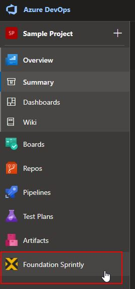
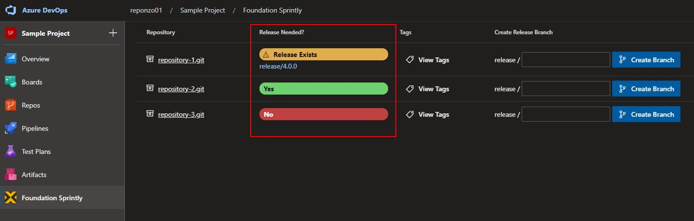
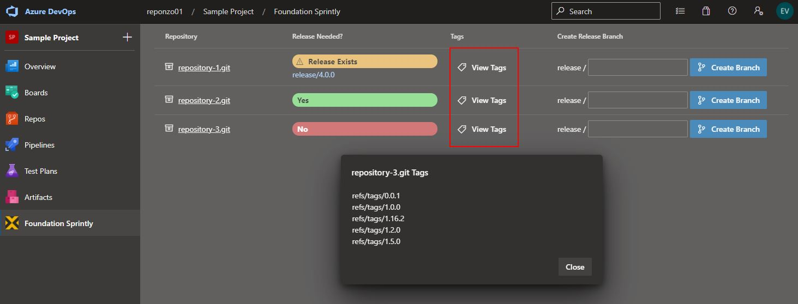
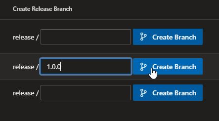
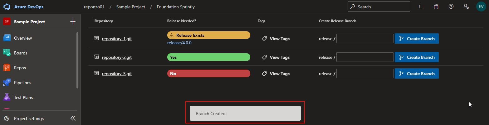
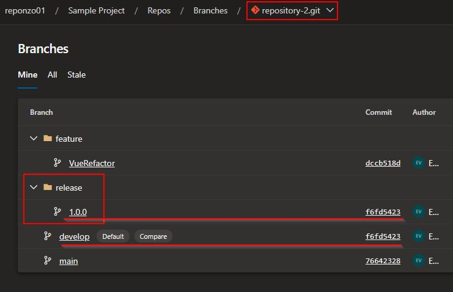

# Release Process Helper for Foundation Software LLC.

This extension provides some helper functionality to aid in the release process.

This extension allows for repositories to be listed on a single page and for release branches to be created for them.

Functionality includes:

- List and link to repositories.
- Indicate whether a repository has a release branch.
- Indicate if the repository has code changes in the `develop` branch that are ahead of `master` or `main`.
- View the tags of the repository.
- Create a `release` branch off of `develop`.

## Screenshots

(NOTE: Right-click the image and Open In A New Tab if the image is too small to see.)
1. After installing the extension, it can be found in the main hub group in the project.

    

2. Each repository is listed and one of three indicators are shown:
- If a `release` branch exists, a yellow indicator will be shown with a link to the `release` branch.
- If the repository has code changes in the `develop` branch that is ahead of `master` or `main`, a green indicator will be shown.
- If there are no code changes between `develop` and `master` or `main`, a red indicator will be shown.
- A repository will not be shown if it is missing a `develop` branch or one of either `master` or `main`.

    

3. The repository's tags can be viewed by clicking on the corresponding `View Tags` button.

    

4. A `release` branch can be created right from this page by entering in a branch name and clicking on `Create Branch`. This will create a `release` branch off of the latest commit on `develop`.

    

5. Once the branch is successfully created, a toast message will indicate its success.

    

6. You can verify the creation of the branch by going to the `Branches` page and seeing that the `release` branch was created with the same commit as `develop` assuming no other commits have been merged to `develop` since the time that the `release` branch was created.

    

## Page Reloads

At the time of this version, page updates do not happen automatically. To see the latest statuses, refresh the extension page.