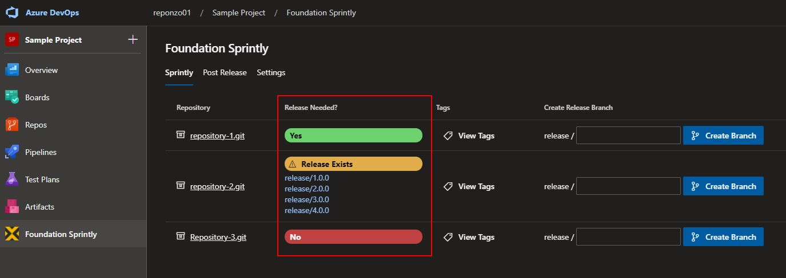

# Release Process Helper for Foundation Software LLC.

This extension provides some helper functionality to aid in the release process.

This extension allows for repositories to be listed on a single page and for release branches to be created for them.

Functionality includes:

-   List and link to repositories.
-   Indicate whether a repository has a release branch.
-   Indicate if the repository has code changes in the `develop` branch that are ahead of `master` or `main`.
-   View the tags of the repository.
-   Create a `release` branch off of `develop`.

After installing the extension, it can be found in the main hub group in the project.

# Tabs

_(NOTE: Right-click the image and Open In A New Tab if the image is too small to see.)_

This extension contains several tabs the offer different functionality. Each tab will be explained here.

## Settings

By default, the Azure groups `Dev Team Leads` and `DevOps` have access to this extension. The dropdowns in this tab can be used to give access to more groups or individuals. If a particular user is part of a group that has access to this extension, that user will have access even if their individual name is not checked in the `Users` dropdown.

The `Repositories` dropdown is a user-level setting. This controls what repositories are shown on the main tab. Each user can set their own list.

After making selections, click `Save` to save your settings. A toast notification will alert you that settings were saved successfully.

## Main Tab

Each repository is listed and one of three indicators are shown:

-   If a `release` branch exists, a yellow indicator will be shown with a link to the `release` branch.
-   If the repository has code changes in the `develop` branch that is ahead of `master` or `main`, a green indicator will be shown.
-   If there are no code changes between `develop` and `master` or `main`, a red indicator will be shown.
-   A repository will not be shown if it is missing a `develop` branch or one of either `master` or `main`.
-   If more than one `release` branch exists, they will all be displayed.

The repository's tags can be viewed by clicking on the corresponding `View Tags` button.

A `release` branch can be created right from this page by entering in a branch name and clicking on `Create Branch`. This will create a `release` branch off of the latest commit on `develop`.

Once the branch is successfully created, a toast message will indicate its success.

You can verify the creation of the branch by going to the `Branches` page and seeing that the `release` branch was created with the same commit as `develop` assuming no other commits have been merged to `develop` since the time that the `release` branch was created.

## Page Reloads

At the time of this version, page updates do not happen automatically. To see the latest statuses, refresh the extension page using the `Refresh` button on the top right corner.

